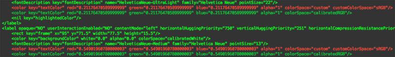

ColorSpaceInvader
=======

OS X's color picker now allows you to specify a hex value when editing a color, which is nice. 

Unfortunately editing a color or even so much as clicking on this field may change the color's color space from Generic RGB (which is probably what you want) to sRGB IEC61966-2.1 or Device RGB (which is probably not what you want). This is, to use a technical term, bad.

Say your designer has asked you to create an element with #CC8844 as the color. If you enter this using the Hex Color # field it will also change the color space and by the time it's rendered on screen, the actual RGB value will be something like #BF7535.

I've been battling this issue quite a bit lately, but identifying these problems is a bit of a pain in Xcode. I was curious if I could slap something together that would parse Storyboard and XIB files and let me know how many color were potentially using the wrong color space. The first project I analyzed had nearly 100 incorrect colors! With a little more effort I was able to output modified Storyboard / XIB with corrected colors.

### How to use ColorSpaceInvader

1. Build the App
2. Run the App
3. Drop a folder containing an Xcode project on the app's window
4. It should produce output like this...

Once it's done, use `git diff` or your favorite SCM tool to make sure that the changes it made are what you expect. You should only see changes like this (assuming there were any to be made):

#Danger!

ColorSpaceInvader doesn't ask your permission before modifying your Storyboard / XIB files. It doesn't make a backup. It doesn't do much of anything really except change your colors to Generic RGB. I make no guarantees that it won't completely jack things up. If ColorSpaceInvader begins to smoke, get away immediately. Seek shelter and cover head. Do not taunt ColorSpaceInvader. In other words you should probably back up, commit, etc., before using the app.
